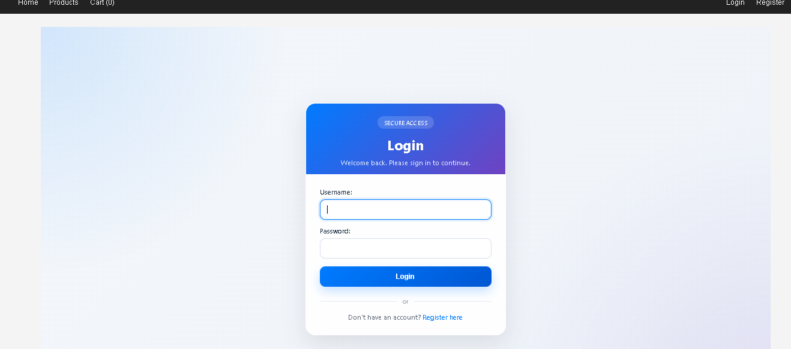
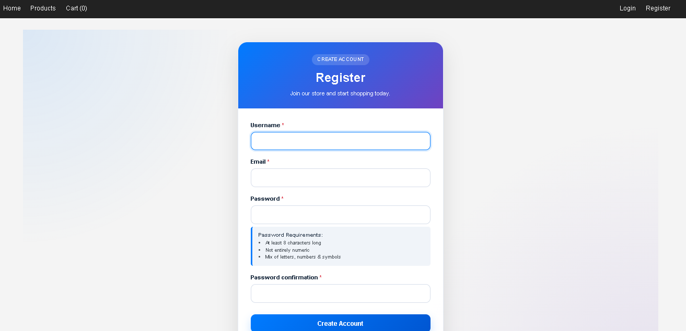
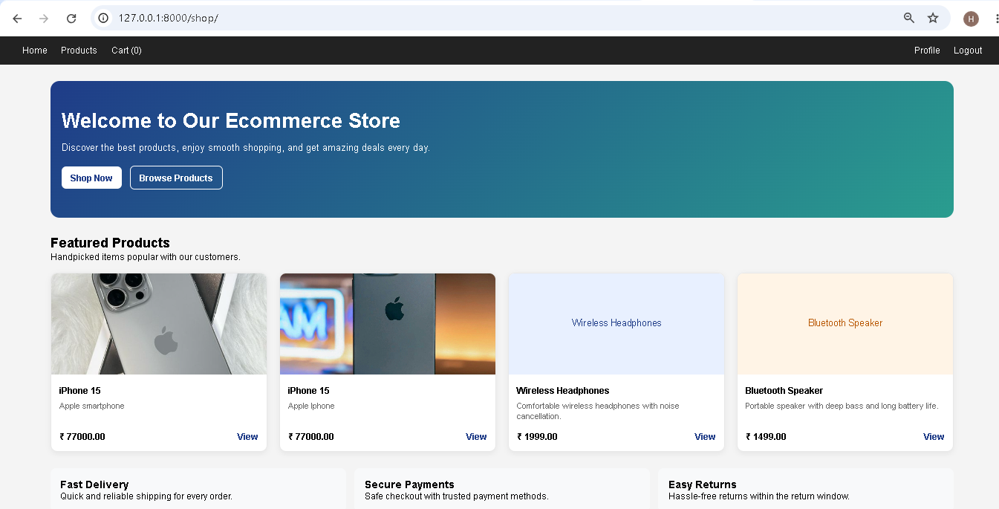
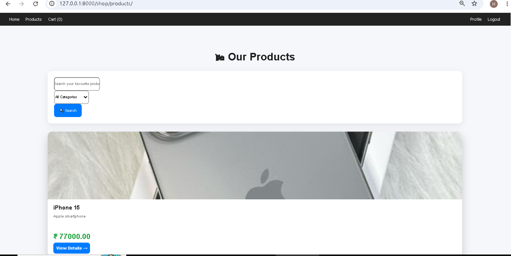
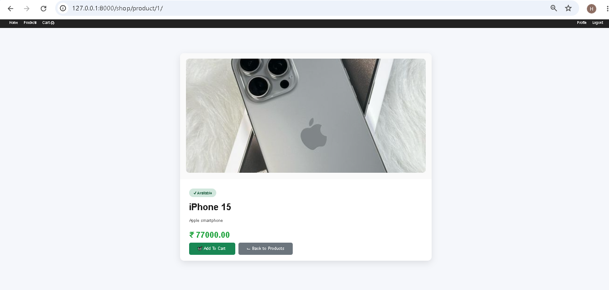
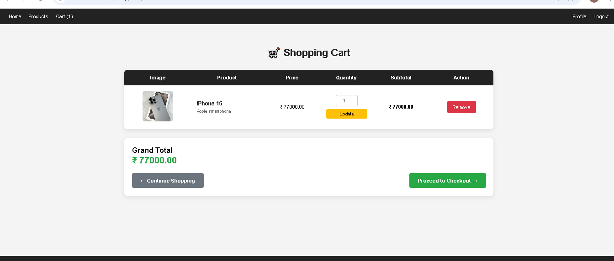
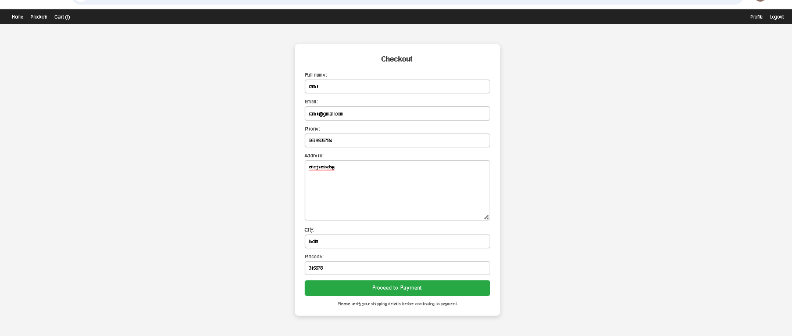
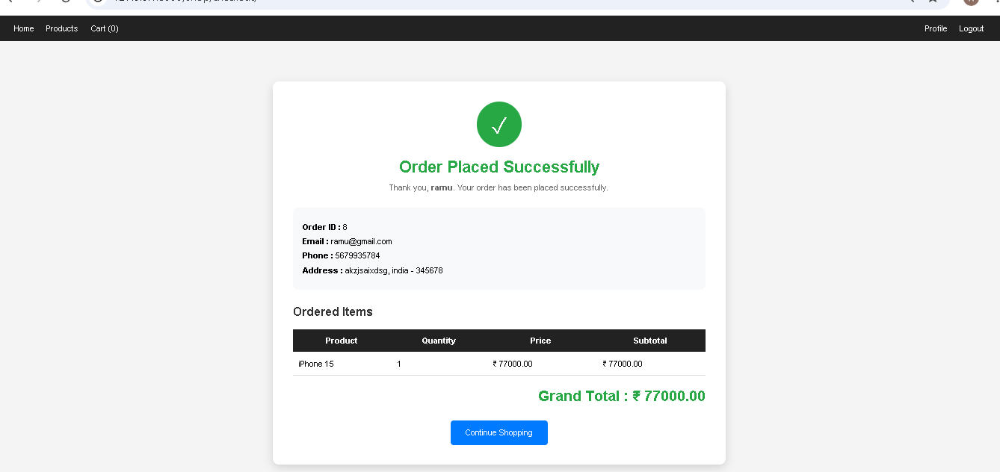
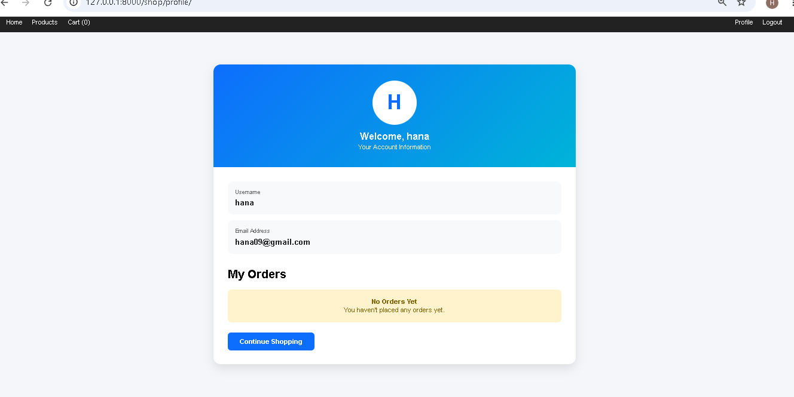

# Django E-Commerce Website

## Internship Task

This project was developed as part of the **Data Alcott Internship** program.

## Features

- ✅ User Registration & Authentication
- ✅ Secure Login & Logout
- ✅ User Profile Management
- ✅ Product Listing & Browsing
- ✅ Product Details Page
- ✅ Advanced Search
- ✅ Category Filtering
- ✅ Shopping Cart
- ✅ Checkout Process
- ✅ Order Management
- ✅ Django Admin Panel

## Technologies Used

- **Backend**: Python, Django
- **Frontend**: HTML, CSS, Bootstrap
- **Database**: SQLite (Development) / MySQL (Production)
- **Authentication**: Django's built-in user system

## Installation

### Prerequisites
- Python 3.8+
- pip
- Virtual Environment

### Setup Steps

```bash
# Clone the repository
git clone https://github.com/YOUR_USERNAME/ecommerce-project.git

# Navigate to project directory
cd ecommerce-project

# Create virtual environment
python -m venv venv

# Activate virtual environment
# On Windows:
venv\Scripts\activate
# On macOS/Linux:
source venv/bin/activate

# Install dependencies
pip install -r requirements.txt

# Run migrations
python manage.py migrate

# Create superuser (optional, for admin access)
python manage.py createsuperuser

# Start development server
python manage.py runserver
```

The application will be available at `http://127.0.0.1:8000/`

---

## Screenshots

### Login Page


### Register Page


### Home Page


### Product List


### Product Details


### Shopping Cart


### Checkout


### Order Success


### User Profile


---

## GitHub Repository

[Your E-Commerce Project Repository]https://github.com/HanaNasrin/ecommerce-project
---

## Internship Task Link

[Data Alcott Internship Task](https://drive.google.com/YOUR_TASK_LINK)

*Use the exact task link that Data Alcott provided during the internship.*

---

## Author

Hana Nasrin

B.Tech Information Technology  
Institute of Engineering & Technology, Calicut University